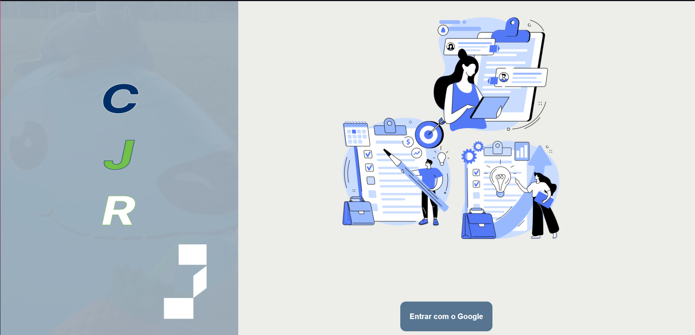

# PDI Front-End

<!---Esses são exemplos. Veja https://shields.io para outras pessoas ou para personalizar este conjunto de escudos. Você pode querer incluir dependências, status do projeto e informações de licença aqui--->




Este projeto é o front-end de um sistema interno da empresa júnior CJR. Contém ao todo 3 páginas e alguns modals(pop-ups) e foi feito em React.js

## 🚀 Instalando 

Para instalar o projeto em seu computado, siga estas etapas:

1) Abra um *git bash* em seu computador, em uma pasta de sua preferência e digite o comando se tiver uma chave SSH configurada em seu PC

Git bash:
```
git clone git@github.com:enzodevs2000/Projeto-Final-PT-CJR-front.git
```

Caso não tenha:

```
git clone https://github.com/enzodevs2000/Projeto-Final-PT-CJR-front.git
```

Com o repositório em seu computador, abra um terminal no diretório do projeto e digite o seguinte comando:

```
    npm install
```

Dessa forma, todas as dependências do projeto serão instaladas


## ☕ Visualizando o projeto

Após a instalação, para visualizar o projeto, execute o comando:

```
npm run dev
```

Com isso, será executado um servidor local em seu computador e o projeto pode ser visualizado


[⬆ Voltar ao topo](#Projeto-Final-PT-CJR-front)<br>

